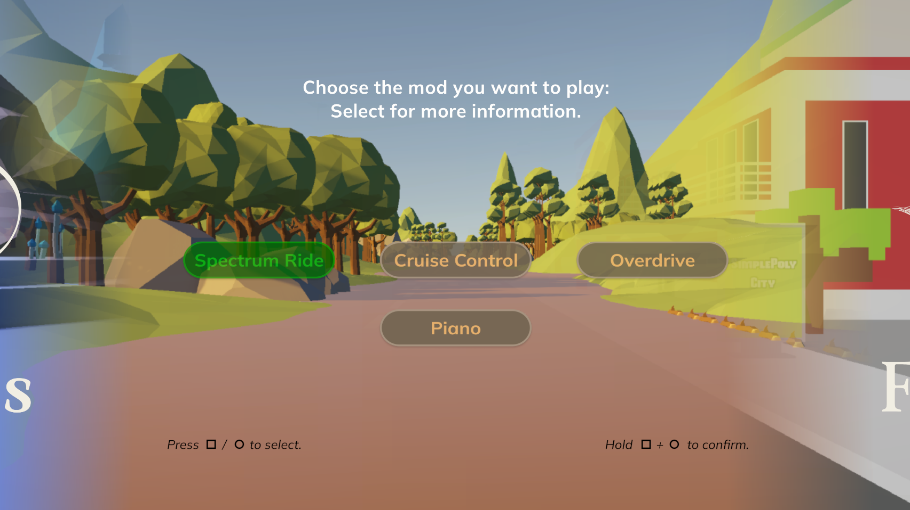
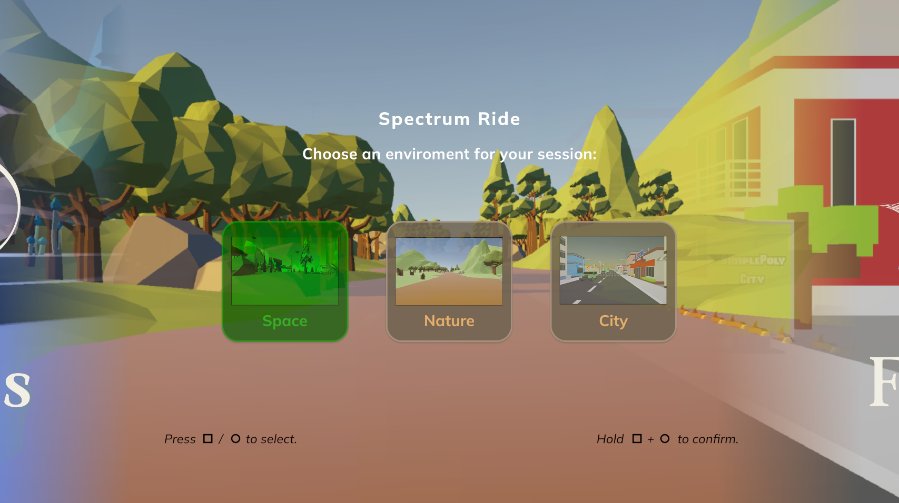
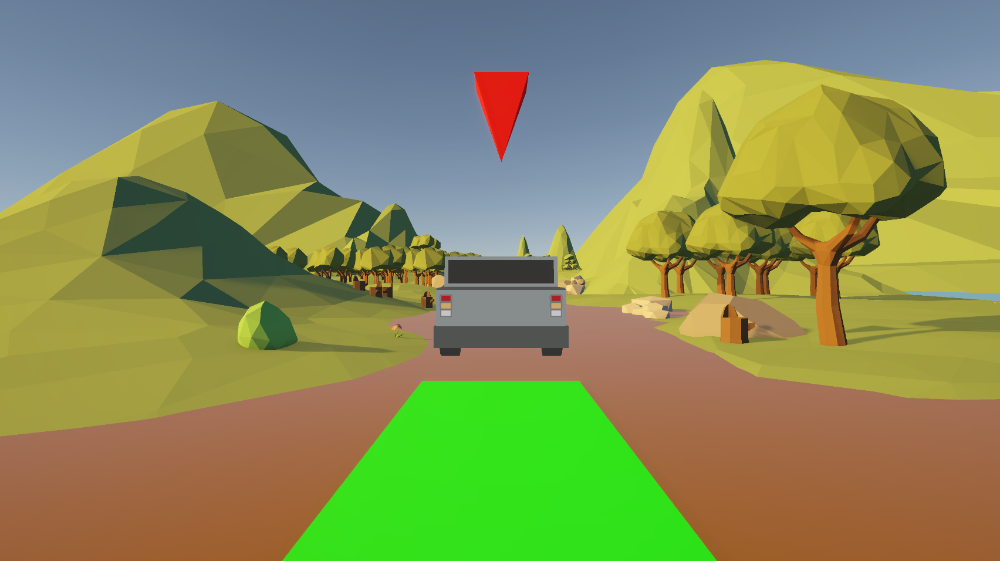
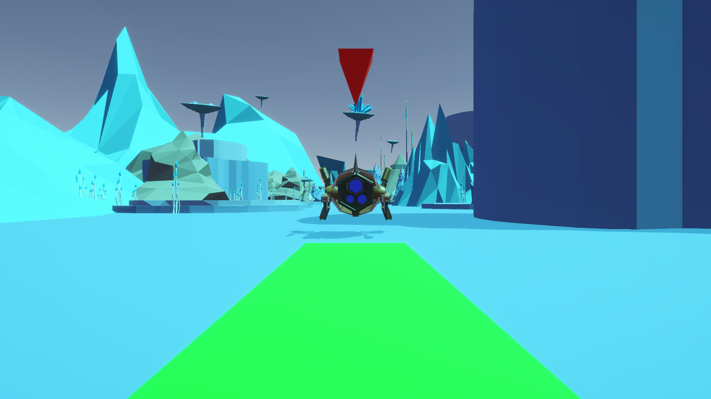
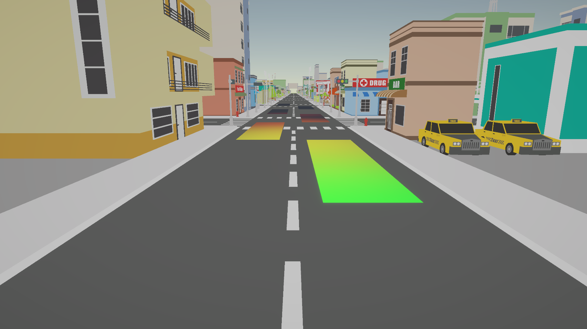

# 🚴 Cycling Frequencies

A Unity game where players pedal to the rhythm!  
Your real-world cycling speed controls the game speed as you follow a car through various environments.  
The car’s movement is based on the audio spectrum of a selected `.mp3` song.

---

## 🎮 Features (Work in Progress)

- 🎵 Music-synced gameplay using audio spectrum analysis
- 🚗 Car movement responding to music
- 🚴‍♂️ Player speed controlled by real cycling input via Arduino
- ⏱ Countdown before game start
- 🧠 XP system based on distance to the car

## 🛠 Tech Stack

- **Unity** 6.1 (6000.1.0f1)
- **Arduino Nano** with Hall sensor and push-buttons
- Serial communication with Unity (via COM port)
- _(Optional but postponed)_ Heart rate sensor integration

---

## 📦 How to Run the Project

1. Clone this repository
2. Open the project in Unity Hub
3. Connect your Arduino (with Hall sensor and buttons) via USB
4. Select the correct COM port if needed
5. Press **Play** to test cycling interaction

---

## 🎨 Unity Assets Used

- 🌲 [Low Poly Simple Nature Pack](https://assetstore.unity.com/packages/3d/environments/landscapes/low-poly-simple-nature-pack-162153)
- 🏙️ [SimplePoly City – Low Poly Assets](https://assetstore.unity.com/packages/3d/environments/simplepoly-city-low-poly-assets-58899)
- 🤖 [Low Poly Combat Drone](https://assetstore.unity.com/packages/3d/characters/robots/low-poly-combat-drone-82234)
- 🪐 [Low Poly Space Alien Worlds – Free Demo](https://assetstore.unity.com/packages/3d/environments/sci-fi/free-demo-of-low-poly-space-alien-worlds-3d-asset-pack-258683)

---

## Sources

- https://www.youtube.com/watch?v=3SdMFPdSi7M
- https://www.youtube.com/watch?v=7BAaUmypaeA&list=PL4tDW7ckeypwQDhD2qPgvHm00NCSYvb-9&index=1&pp=gAQBiAQB
- https://www.youtube.com/watch?v=YoGnxoJR_s4&list=PL4tDW7ckeypwQDhD2qPgvHm00NCSYvb-9&index=2&pp=gAQBiAQB
- https://www.youtube.com/watch?v=5rxMdiCkQGk&list=PL4tDW7ckeypwQDhD2qPgvHm00NCSYvb-9&index=3&pp=gAQBiAQB
- https://www.youtube.com/watch?v=YOaYQrN1oYQ&list=PL4tDW7ckeypwQDhD2qPgvHm00NCSYvb-9&index=4&t=137s&pp=gAQBiAQB
- https://www.youtube.com/watch?v=iIwcqgAPVWI&list=PL4tDW7ckeypwQDhD2qPgvHm00NCSYvb-9&index=5&t=250s&pp=gAQBiAQB
- https://www.youtube.com/watch?v=ijAN0QI70UU&list=PL4tDW7ckeypwQDhD2qPgvHm00NCSYvb-9&index=6&t=263s&pp=gAQBiAQB
- https://chatgpt.com/share/684c2d18-31ec-8003-a05b-994dc7cdbd06
- https://chatgpt.com/share/684c29ab-e42c-8003-bba6-0b0802776759
- https://chatgpt.com/share/684c2b90-acfc-8003-9a4e-91aad23c3123
- https://chatgpt.com/share/684c2bed-2164-8003-b0d7-9c0414fe2225
- https://chatgpt.com/share/684c2c0f-d3f8-8003-9f94-d8066c751399
- https://chatgpt.com/g/g-p-68136010669c8191b0c690efebcca5ae-final-work/c/682324f6-9484-8003-8dda-abe74c47c9dc
- https://chatgpt.com/share/684c2cc6-9fa0-8003-9a56-df4ed9555e17
- \*Asstistance with some errors and code with Github-Copilot (VSC plug-in)
- https://www.youtube.com/watch?v=vefFgerTgPc

---

## 📸 Screenshots

---

## 👨‍💻 Author

**Julien De Reuse**  
[GitHub Profile](https://github.com/Julien-De-Reuse)  
Student at Erasmushogeschool Brussel
